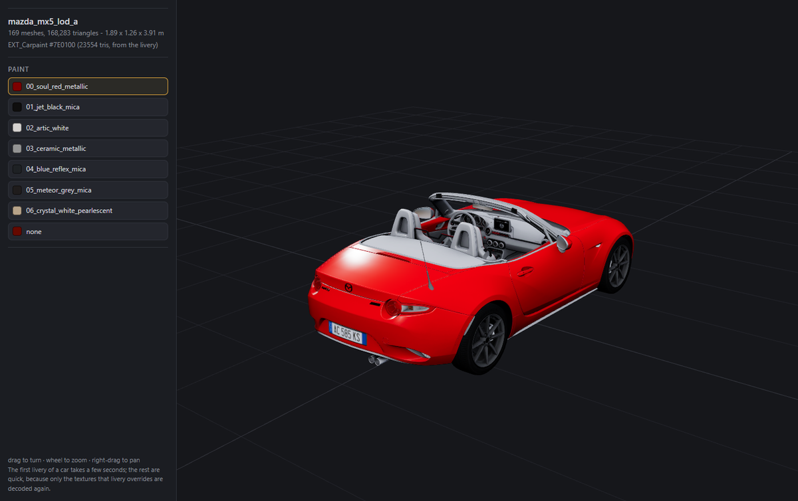

# Previewing with kn5-studio

Converting a car takes a few seconds and a browsing session is twenty cars.
`kn5-studio` is there so you can look first.

```console
kn5-studio <CAR-OR-FOLDER> [--out DIR] [--port 8731] [--no-open]
```

It converts the car, serves the result to a local page and opens it. The page
turns the model round; clicking a livery re-converts and reloads. Ctrl-C stops
it.

<figure class="shot" markdown="0">

<figcaption>Model: <code>ks_mazda_mx5_nd</code>, &copy; Kunos Simulazioni. Shown to
illustrate the tool; no Assetto Corsa content is distributed with this project.
</figcaption>
</figure>

## One car

```console
$ kn5-studio "…/content/cars/ks_mazda_mx5_nd/mazda_mx5_lod_a.kn5"
```

## A whole library

Hand it a `content/cars` folder and the page gets a car picker with a filter
box. Nothing is converted until you choose one, and the right `.kn5` inside
each folder is picked for you — see
[Which .kn5 is the car?](cars.md#which-kn5-is-the-car).

```console
$ kn5-studio "C:\Program Files (x86)\Steam\steamapps\common\assettocorsa\content\cars"
```

## Nothing is kept unless you ask

Without `--out` the conversion goes to a temporary folder that is deleted when
the tool stops. Looking at a car is not the same as importing it, and browsing
twenty should not leave twenty on disk.

```console
$ kn5-studio <car.kn5> --out build/import     # keep this one
```

## Why a browser

The conversion has always lived in Python and the engine side has never needed
to know about `.kn5`. A viewer built into a 3D application would invert that —
an Assetto Corsa panel, a process launcher and a staging folder, to answer a
question the application has no stake in.

A browser is a glTF renderer that is already installed and already correct: PBR,
sRGB, tone mapping, mipmaps, an orbit camera. three.js is vendored next to the
tool, so there is no network dependency and no CDN moving underneath it.

## Why it re-converts when you click a colour

On a Kunos road car the paint is not a texture the page could swap. It is a
base-colour **factor** derived from the livery's flat detail map — see
[where the colour comes from](cars.md#where-the-colour-actually-comes-from) —
so changing colour changes the glTF, and the honest way to show the result is to
produce it.

It is faster than it sounds. Textures already decoded for the current car are
reused, and a livery overrides three maps out of fifty. Measured on
`ks_bmw_z4`: 5.92 s for the first livery, 0.86 s for every one after it.

## Security

The server binds `127.0.0.1` and serves exactly three things: the viewer page,
the vendored three.js beside it, and the converted model. It does **not** serve
the directory you started it from — `SimpleHTTPRequestHandler` maps URLs onto
the working directory by default, and a local web server handing out your source
tree is a real hazard, so the path translation is replaced. Directory traversal
in every shape tried is refused, and that is covered by
[the test suite](development.md#the-tests).

Conversion failures come back as `{"error": …}` rather than as a traceback into
a socket, because the page has nowhere to show a 500.

## Options

| Option | Meaning |
|---|---|
| `--out DIR` | keep the converted glTF here |
| `--name NAME` | basename for the `.gltf` |
| `--port N` | default `8731` |
| `--no-open` | do not launch a browser; print the URL |

## Third party

three.js r160 is vendored under `src/acgltf/viewer/three/`, MIT licensed. It is
a browser dependency of this one tool — nothing else in the package loads it,
and deleting the folder breaks only `kn5-studio`.
